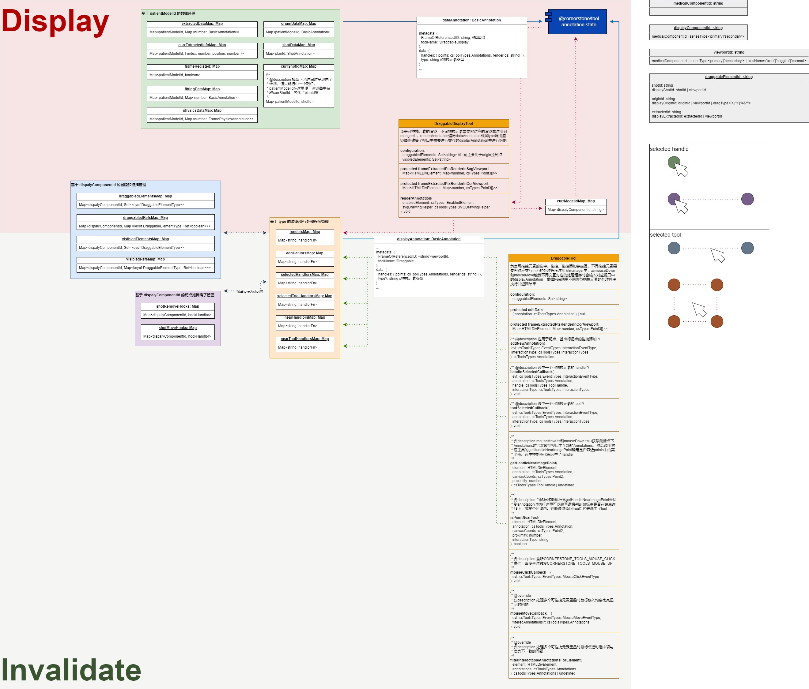

## 状态管理

### 组件ID

    在our-medical的设计中，MedicalImage是唯一对外暴漏的vue组件供开发者使用，但在底层利用两个SeriesDisplay组件实现主次序列的独立呈现及状态管理。在向MedicalImage组件提供ID时，这个ID称之为MedicalComponentID，而底层的两个SeriesDisplay组件会根据MedicalComponentID衍生出两个独立的DisplayComponentID。

```typescript
type MedicalComponentID = string
type DisplayComponentID = `${MedicalComponentID}|${'primary' | 'secondary'}`
```

    每个SeriesDisplay对应一个cornerstone3D中的ToolGroup并共享DisplayComponentID。

### 工具管理

    在向视口添加工具或设置工具状态时，可以通过toolsStateManager来实现。our-medical提供如下API将需要的工具绑定到视口中，这些工具包括cornerstone3D提供的工具或开发者继承BaseTool定义的工具。工具在cornerstone3D具有4种[Modes](https://www.cornerstonejs.org/docs/concepts/cornerstone-tools/tools#tool-modes)，但our-medical中目前仅使用到3种。

```typescript
import type { Types as toolsTypes } from '@cornerstonejs/tools'
import { managers } from 'our-medical'

const { toolsStateManager } = managers

toolsStateManager.addATool(
  id: MedicalComponentID | DisplayComponentID,
  ToolClass: any,
  configuration?: toolsTypes.ToolConfiguration
)

toolsStateManager.setAToolActived(
  id: MedicalComponentID | DisplayComponentID,
  toolClassName: string
)

toolsStateManager.setAToolEnabled(
  id: MedicalComponentID | DisplayComponentID,
  toolClassName: string
)

toolsStateManager.setAToolDisabled(
  id: MedicalComponentID | DisplayComponentID,
  toolClassName?: string
)

toolsStateManager.setToolConfiguration(
  id: MedicalComponentID | DisplayComponentID,
  toolClassName: string,
  configuration: toolsTypes.ToolConfiguration
)
```

    API调用时如果传入的是MedicalComponentID则会影响到主次两个序列的视口，如果传入的是DisplayComponentID仅影响主/次单个序列的视口。

### 体积管理

    当MedicalImage的layout属性被设置为CONSTANT.Layout.Fusion时，可以通过体积管理对浮动层的体积进行透明度、伪彩、平移和旋转设置。

```typescript
import type { Types as coreTypes  } from '@cornerstone/core'
import { managers } from 'our-medical'

const { volumeStateManager } = managers

// 返回vtk中的伪彩名称列表
volumeStateManager.getColorMap()

// 设置组件中浮动层伪彩
volumeStateManager.setColor(
  componentId: MedicalComponentID | DisplayComponentID,
  name: string, //名称需来自vtk的伪彩名称列表中
  updateViewport?: boolean //是否立即更新视口，默认为：true
)

volumeStateManager.getColor(componentId: MedicalComponentID | DisplayComponentID)

// 设置组件浮动层不透明度
volumeStateManager.setOpacity(
  componentId: MedicalComponentID | DisplayComponentID,
  opacity: number,
  updateViewport?: boolean
)

volumeStateManager.getOpacity(componentId: MedicalComponentID | DisplayComponentID)

// 还原体的旋转和位移
volumeStateManager.resetVolume(
  id: string, //体积/序列ID
  options?: {
    componentIds?: string[] //要被更新的组件ID
    immediate: boolean  //是否立即更新视口，默认为：true
  }
)

// 始终从体积的原始状态开始旋转、平移体积
volumeStateManager.setVolumeFromOriginal(
  id: string, //体积/序列ID
  options: {
    angle: coreTypes.Point3 //旋转角度
    center: coreTypes.Point3 //旋转中心
    translation: coreTypes.Point3 //平移
    isDegrees?: boolean //旋转角度单位是否为度
    componentIds?: string[] //要被更新的组件ID
  },
  immediate?: boolean  //是否立即更新视口，默认为：true
)
```

    如果一个序列存在配准数据的情况下，也可以在其记载结束后通过setVolumeFromOriginal设置配准数据。

### 分割体积管理

    segmentationStateManager依赖于cornerstone3D中的[Segmentations](https://www.cornerstonejs.org/docs/concepts/cornerstone-tools/segmentation/)实现。在cornerstone3D中，Segmentations的设计理念偏向于对人体器官进行勾画，不能在某一层上产生相互重叠的Segmentation，但在放疗的临床应用中PTV、CTV、GTV等靶区体积存在包含关系。segmentationStateManager的设计思路是通过创建多个Segmentation来勾画不同的器官和靶区，这样做解决了体积重叠、包含等问题，但同时带来前端内存压力较大的负面影响，并且切换Actived分割体积时会经过重建将非Actived体积缩小释放部分内存，过程较慢。

#### 创建空体积

    通过createSegmentation可以创建voxels为0的空体积用于勾画操作，接收两个参数seriesId和volumeId，其中seriesId为创建空体积时需要参照的序列，volumeId为体积ID或名称，当空体积创建之后会返回一个segmentationId用于之后创建representation或设置颜色等其他操作。

```typescript
import { managers } from 'our-medical'

const { segmentationStateManager } = managers
const { segmentationId, volumeLoader } = segmentationStateManager.createSegmentation({
  seriesId: string
  volumeId: string
})

// 向ToolGroup中添加segmentationRepresentation，异步
segmentationStateManager.addRepresentationsAsync(
  componentId: MedicalComponentID | DisplayComponentID,
  segmentationIds: { segmentationId: string; segmentIndex: number }[],
  active?: boolean
).then(toolGroupRepresentationUIDMap => {
  /**
   * 如果返回Map对象表示添加成功，否则为undefined
   * toolGroupRepresentationUIDMap的结构为:
   * Map<DisplayComponentID , Map<SegmentationID, RepresentationID>>
   *
   * Map<SegmentationID, RepresentationID>中记录了segmentationId
   * 和segmentationRepresentationUID的映射关系
   */

  // 给segmentationRepresentation设置勾画填充值及体积颜色
  segmentationStateManager.setRepresentationColor(
    toolGroupId: DisplayComponentID,
    segmentationId: string,
    segmentIndex: number,
    color: [number, number, number, number]
  )
})

// volumeLoader是执行体积创建的Promise
volumeLoader.then(() => {
  /**
   * 设置Actived分割体积，会消耗较长时间对两个体积进行重建
   * 切换分割体积时可以显示加载动画，通过then在成功后隐藏加载动画
   */
  segmentationStateManager.setActiveSegmentation(
    componentId: MedicalComponentID | DisplayComponentID,
    segmentation?: {
      seriesId: string
      segmentIndex: number //分割体积中勾画区域voxels填充的数值
      segmentationId?: string
      volumeId: string
    },
    options = {
      activeMaximize: true, //默认为true，表示需要将Actived分割体积按照序列尺寸最大化
      inactiveMinimize: true //默认为true，表示需要将Inactived分割体积按照勾画范围最小化
    }
  ).then(segment => {
    // do something ...
  })
})
```

#### 导入/导出勾画

    通过调用getContourData可以导出如下格式的勾画数据。

```typescript
import type { Types as coreTypes } from '@cornerstone/core'
import type { PointLower } from '@doodle3d/clipper-js'

type ContourData = {
  bounds: number[] //勾画轮廓外包围盒world坐标系下尺寸
  boundsIJK: number[] //勾画轮廓外包围盒在分割体积中的IJK
  direction: coreTypes.Mat3 //数据是以轴状位的方向到处
  dimensions: coreTypes.Point3
  origin: coreTypes.Point3
  contours: Map<number, PointLower[][]>
  spacing: coreTypes.Point3
  volumeValue: number
}
```

```typescript
import { managers } from 'our-medical'
const { segmentationStateManager } = managers

// 异步
segmentationStateManager.getContourData(segmentationId: string)
```

    导入的勾画数据格式。

```typescript
import type { Types as coreTypes } from '@cornerstone/core'
import type { PointLower } from '@doodle3d/clipper-js'

type ContourData = {
  bounds: number[] //分割体积外包围盒world坐标系下尺寸
  contours: { [zPosition: string]: PointLower[][] } }
  volumeValue: number
}
```

    通过调用createSegmentationByContoursData可以将勾画数据导入并创建分割体积。

```typescript
import { managers } from 'our-medical'

const { segmentationStateManager } = managers

const { segmentationId, volumeLoader, volumeFillAsync } = segmentationStateManager.createSegmentationByContoursData(
  segment：{
    seriesId: string
    volumeId: string
    segmentIndex: number
  },
  contoursData: ContourData,
  minimize?: boolean //默认以包围盒尺寸创建最小体积
)

// volumeFillAsync是执行勾画填充的Promise，当浏览器支持OffscreenCanvas时会执行多线程填充
volumeFillAsync.then((segmentVolumeId) => {})
```

    在分割体积已存在的情况下可以通过勾画数据对分割体积进行更新。

```typescript
import { managers } from 'our-medical'

const { segmentationStateManager } = managers

segmentationStateManager.updateSegmentationByContoursData(
  segment：{
    segmentationId: string
    segmentIndex: number
  },
  contoursData: ContourData
)
```

#### 其他API

```typescript
import { managers } from 'our-medical'

const { segmentationStateManager } = managers

// 设置Segmentations的显隐状态
segmentationStateManager.setSegmentationsVisibility(
  componentId: MedicalComponentID | DisplayComponentID ,
  segments: Array<{ segmentationId: string, segmentIndex: number }>,
  visibility?: boolean //默认为true
)

// 重置segmentation中的voxels为0
segmentationStateManager.resetSegmentation(segmentationId: string)

// 清除轴状位方向上指定层上的勾画轮廓
segmentationStateManager.removeContoursOnSlice(
  segments: { segmentationId: string, segmentIndex: number },
  worldZ: number
)

// 删除cornerstone3D中cache和segmentation中的分割体积
segmentationStateManager.deleteSegmentation(
  componentId: MedicalComponentID | DisplayComponentID ,
  segmentationIds: string[],
  _deleteContourData?: boolean //默认为true, 删除记录的勾画数据
)
```

### 拖拽管理

    该模块对可进行拖拽操作的元素数据进行分类，元素的渲染和交互操作由DraggableTool和DraggableDisplayTool两个工具负责，其中包括的子模块有患者原点、影像中心、基准标记点、头框点及头钉点、治疗床、靶点及剂量点。

```typescript
import { managers } from 'our-medical'
const { draggableStateManager } = managers
const { couch, dosePoint, draggable, fiducial, frame, imageCenter, nail, origin, registe, shot } = draggableStateManager

// 所有拖拽元素附加在患者模型上，主次序列可以设置不同的患者模型
draggableStateManager.setModelId(ComponentID, modelId: string)

// 可以向主/次序列上设置不同的计划ID，计划同样归属于一个患者模型
draggableStateManager.setPlanId(ComponentID, planId: string)
```

    每个子模块中提供对该类型数据增删改查API。

#### couch

```typescript
import type { Types as coreTypes } from '@cornerstone/core'

// 添加治疗床
couch.add(
  modelId: string, //患者模型ID
  planId: string, //计划ID
  data: {
    couchSize: coreTypes.Point3 //治疗床尺寸，单位为mm
    point: coreTypes.Point3 //治疗床原点坐标，以治疗床长宽高中心为治疗床原点
    planId?: string
    originRender?: Function //治疗床原点坐标渲染函数
    annotationUID?: string
  },
  componentIds?: MedicalComponentID[] //可选，提供组件ID可立即触发视口渲染
)

couch.get(planId: string)

// 删除治疗床
couch.remove(planId: string, componentIds?: MedicalComponentID[])

// 更新治疗床位置
couch.update(
  planId: string,
  position: coreTypes.Point3,
  componentIds?: MedicalComponentID[]
)
```

#### dosePoint

```typescript
import type { Types as coreTypes } from '@cornerstone/core'
import type vtkImageData from '@kitware/vtk.js/Common/DataModel/ImageData'

// 添加剂量点
dosePoint.add(
  modelId: string, //患者模型ID
  planId: string, //计划ID
  data: {
    pointId: string;
    point: coreTypes.Point3; //剂量点坐标
    number?: number //剂量点编号，不提供时不显示编号
  },
  componentIds?: MedicalComponentID[] //可选，提供组件ID可立即触发视口渲染
)

// 获取剂量点
dosePoint.get(planId: string, pointId?: string)

// 删除剂量点
dosePoint.remove(
  planId: string,
  pointId: string,
  componentIds?: MedicalComponentID[]
)

// 更新剂量点，普通模式下采用merge处理，overwrite模式下重新赋值
dosePoint.update(
  planId: string,
  pointId: string,
  data: { point?: coreTypes.Point3; number?: number },
  componentIds: MedicalComponentID[],
  overwrite?: boolean
)

// 批量更新计划下的剂量点列表，自动清空已有剂量点
dosePoint.updateAll(
  modelId: string,
  planId: string,
  data: Array<{ pointId: string; point: coreTypes.Point3; number?: number }>,
  componentIds: MedicalComponentID[],
)
```

#### draggable

```typescript
// 获取组件中拖拽元素拖拽状态的响应式数据
draggable.getDraggableRefs(componentId: MedicalComponentID | DisplayComponentID)

// 获取组件中可操作的拖拽元素列表
draggable.getVisibleRefs(componentId: MedicalComponentID | DisplayComponentID)

// 获取组件中拖拽元素显示状态的响应式数据
draggable.getDraggableElements(componentId: DisplayComponentID)

// 获取组件中显示的拖拽元素列表
draggable.getVisibledElements(componentId: DisplayComponentID)

// 重置拖拽状态,默认为false
draggable.resetDraggabledState(
  componentId: DisplayComponentID,
  draggable?: boolean
)

// 重置可拖拽元素的显隐状态，默认为true
draggable.resettVisibledState(
  componentId: DisplayComponentID,
  visible?: boolean
)

// 设置患者原点可否被拖拽
draggable.setOriginDraggable(
  componentId: MedicalComponentID | DisplayComponentID,
  draggable = true
)

// 设置患者原点的显隐
draggable.setOriginVisible(
  componentId: MedicalComponentID | DisplayComponentID,
  visiable = true
)

// 设置靶点可否被拖拽
draggable.setShotDraggable(
  componentId: MedicalComponentID | DisplayComponentID,
  draggable = true
)

// 设置靶点的显隐
draggable.setShotVisible(
  componentId: MedicalComponentID | DisplayComponentID,
  visiable = true
)

// 设置头架提取点可否被拖拽
draggable.setFrameExtDraggable(
  componentId: MedicalComponentID | DisplayComponentID,
  draggable = true
)le.

// 设置头架提取点的显隐
draggable.setFrameExtVisible(
  componentId: MedicalComponentID | DisplayComponentID,
  visiable = true
)

// 设置头架拟合点的显隐
draggable.setFrameFitVisible(
  componentId: MedicalComponentID | DisplayComponentID,
  visiable = true
)

// 设置头架物理点的显隐
draggable.setFramePhyVisible(
  componentId: MedicalComponentID | DisplayComponentID,
  visiable = true
)

// 设置头钉点是否可以拖拽
draggable.setNailDraggable(
  componentId: MedicalComponentID | DisplayComponentID,
  draggable = true
)

// 设置头钉点的显隐
draggable.setNailVisible(
  componentId: MedicalComponentID | DisplayComponentID,
  visiable = true
)

// 设置影像中心拖拽
draggable.setImageCenterDraggable(
  componentId: MedicalComponentID | DisplayComponentID,
  draggable = true
)

// 设置影像中心显隐
draggable.setImageCenterVisible(
  componentId: MedicalComponentID | DisplayComponentID,
  visiable = true
)

// 设置治疗床拖拽
draggable.setCouchDraggable(
  componentId: MedicalComponentID | DisplayComponentID,
  draggable = true
)

// 设置治疗床显隐
draggable.setCouchVisible(
  componentId: MedicalComponentID | DisplayComponentID,
  visiable = true
)

// 设置基准标记点拖拽
draggable.setFiducialDraggable(
  componentId: MedicalComponentID | DisplayComponentID,
  draggable = true
)

// 设置基准标记点显隐
draggable.setFiducialVisible(
  componentId: MedicalComponentID | DisplayComponentID,
  visiable = true
)

// 设置剂量点可否被拖拽
draggable.setDosePointDraggable(
  componentId: MedicalComponentID | DisplayComponentID,
  draggable = true
)

// 设置剂量点的显隐
draggable.setDosePointVisible(
  componentId: MedicalComponentID | DisplayComponentID,
  visiable = true
)
```

#### fiducial

```typescript
import type { Types as coreTypes } from '@cornerstone/core'

// 添加基准标记点
fiducial.add(
  modelId: string, //患者模型ID
  data: {
    pointId: string //标记点ID
    position: coreTypes.Point3 //标记点坐标
    color: string //标记点颜色
  },
  componentIds?: MedicalComponentID[] //可选，提供组件ID可立即触发视口渲染
)

// 获取基准标记点
fiducial.get(modelId: string, pointId?: string)

// 更新基准标记点信息
fiducial.update(
  modelId: string,
  data: {
    pointId: string
    color?: string
    point?: coreTypes.Point3
    markerId?: string
  },
  componentIds?: MedicalComponentID[]
)

// 删除基准标记点
fiducial.remove(
  data: {
    modelId: string
    pointId?: string //可选，不提供时删除全部基准标记点
  },
  componentIds?: MedicalComponentID[]
)
```

#### frame

```typescript
import type { Types as coreTypes } from '@cornerstonejs/core'

type FramePointsStyleOption = {
  pointColor?: string
  selectedColor?: string
  fontSize?: string
  lineColor?: string
  lineWidth?: number
  lineDash?: number[]
}

type ModelMap = Map<Position, FramePointsAnnotation>

type Data = Map<
  number, //轴状位Z方向坐标
  {
    points: coreTypes.Point3[] //提取点、拟合点、物理点数据，coreTypes.Point3[]长度为6
    deviations?: number[] //提取点偏差值
    options?: FramePointsStyleOption
  }
>

// 设置提取点数据
frame.setExtractedPoints(
  modelId: string, //患者模型ID
  data: Data,
  componentIds?: MedicalComponentID[] //可选，提供组件ID可立即触发视口渲染
)

// 获取提取点数据
frame.getExtractedPoints(modelId: string, position?: number)

// 更新提取点坐标
frame.updateExtractedPoint(
  modelId: string,
  data: {
    point: coreTypes.Point2
    index?: number
    position?: Position
  },
  componentIds?: MedicalComponentID[],
  emit?: boolean //默认为false，不触发头框顶点坐标变化事件
)

// 清空提取点数据
frame.clearExtractedPoints(modelId: string, componentIds?: MedicalComponentID[])

// 更新某层或全部头架提取点样式
frame.updateExtractedPointsStyle(
  modelId: string,
  data: {
    options: FramePointsStyleOption,
    position?: number //轴状位Z方向坐标
  },
  componentIds: MedicalComponentID[]
)

// 设置当前提取点
frame.setCurrExtractedInfo(
  modelId: string,
  data: {
    index: number //层上提取点下标
    position: number //提取点所在层
  },
  emit?: boolean //默认为false，不触发当前提取点选中变化事件
)

// 获取当前提取点
frame.getCurrExtractedInfo(modelId: string)

// 设置头款注册状态
frame.setFrameRegisted(
  modelId: string, //患者模型ID
  registed: boolean, //默认为true，设置头框状态为已注册
  componentIds: MedicalComponentID[]
)

// 获取头款注册状态
frame.getFrameRegisted(modelId: string)

// 设置拟合点数据
frame.setFittingPoints(modelId: string, data: Data, componentIds?: MedicalComponentID[])

// 获取拟合点数据
frame.getFittingPoints(modelId: string, position?: Position)

// 清空拟合点数据
frame.clearFittingPoints(modelId: string, componentIds?: MedicalComponentID[])

// 设置物理点数据
frame.setPhysicsPoints(modelId: string, data: Data, componentIds?: MedicalComponentID[])

// 获取物理点数据
frame.getPhysicsPoints(modelId: string, position?: number)

// 清空物理点数据
frame.clearPhysicsPoints(modelId: string, componentIds?: MedicalComponentID[])
```

#### imageCenter

```typescript
import type { Types as coreTypes } from '@cornerstonejs/core'


// 添加影像中心数据
imageCenter.add(
  modelId: string,
  data: { pointId?: string; point: coreTypes.Point3 },
  componentIds?: MedicalComponentID[]
)

// 获取影像中心数据
imageCenter.get(modelId: string)

// 删除影像中心数据
imageCenter.remove(modelId: string, componentIds?: MedicalComponentID[])

// 更新影像中心数据
imageCenter.update(
  pointId: string,
  point: coreTypes.Point3,
  componentIds?: MedicalComponentID[]
)
```

#### nail

```typescript
import type { Types as coreTypes } from '@cornerstonejs/core'

type nailData = Map<number, coreTypes.Point3>

// 设置头钉数据
nail.set(modelId: string, data: nailData, componentIds?: MedicalComponentID[])

// 获取头钉数据
nail.get(modelId: string, index?: number)

// 清空头钉数据
nail.clear(modelId: string, componentIds?: MedicalComponentID[])

// 更新头钉点位置
nail.updata(
  modelId: string,
  data: { point: coreTypes.Point3; index?: number },
  componentIds?: MedicalComponentID[]
)

// 添加头钉点
nail.add(
  modelId: string, //患者模型ID
  data: {
    point: coreTypes.Point3
    index: number //头钉点下标
  },
  componentIds?: MedicalComponentID[]
)

// 移除头钉
nail.remove(
  data: { modelId: string; index?: number },
  componentIds?: MedicalComponentID[]
)

// 设置当前头钉点
nail.setCurrNail(
  modelId: string, //患者模型ID
  index: number, //头钉点下标
  componentIds?: MedicalComponentID[],
  emit?: boolean //默认为false，不触发当前头钉点变化事件
)

// 获取当前选中头钉点
nail.getCurrNail(modelId: string)
```

#### origin

```typescript
import type { Types as coreTypes } from '@cornerstonejs/core'

// 添加患者原点数据
origin.add(
  modelId: string, //患者模型ID
  data: { pointId?: string; point: coreTypes.Point3 },
  componentIds?: MedicalComponentI //可选，提供组件ID可立即触发视口渲染
)

// 删除患者原点数据
origin.remove(modelId: string, componentIds?: MedicalComponentID[])

// 获取患者原点数据
origin.get(modelId: string)

// 更新患者原点坐标
origin.update(
  pointId: string,
  point: coreTypes.Point3,
  componentIds?: MedicalComponentID[]
)
```

#### shot

```typescript
import type { Types as coreTypes } from '@cornerstonejs/core'

type Shot = {
  collSize: number
  number?: number //提供后显示靶点编号
  point: coreTypes.Point3
  pointId?: string
  targetId?: string //靶点归属的靶区ID，暂时未实现靶区功能
}

// 添加靶点
shot.add(
  modelId: string,
  planId: string,
  data: Shot,
  componentIds?: MedicalComponentID[] //可选，提供组件ID可立即触发视口渲染
)

// 获取计划中的单个或全部靶点
shot.get(planId: string, pointId?: string)

// 删除计划中的单个或全部靶点
shot.remove(
  planId: string,
  pointId?: string,
  componentIds?: MedicalComponentID[]
)

// 更新靶点ID
shot.updateId(planId: string, prevId: string, currId: string)

// 更新靶点数据，普通模式下采用merge处理，overwrite模式下重新赋值
shot.update(
  planId: string,
  pointId: string,
  data: Omit<Partial<Shot>, 'pointId'>,
  componentIds?: MedicalComponentID[],
  overwrite?: boolean
)

// 批量更新计划下的靶点列表，自动清空已有靶点
shot.updateAll(
  modelId: string,
  planId: string,
  data: Shot[],
  componentIds?: MedicalComponentID[]
)
```

#### registe

    registe模块设计用于对拖拽工具进行扩展。拖拽元素的渲染与交互依赖cornerstone3D中[Annotations](https://www.cornerstonejs.org/docs/concepts/cornerstone-tools/annotation/)的概念，将拖拽数据分为原始数据和渲染数据，通过拖拽管理模块API设置的数据为原始数据，渲染数据在DraggableDisplayTool中生成。在扩展拖拽元素时不同处理程序的type必须相同，表示处理的是同一类元素。拖拽元素的渲染、交互设计如下图所示：



##### 处理程序注册

    registe中对处理程序采取注册机制，不同的处理程序将在DraggableTool的addNewAnnotation、handleSelectedCallback、toolSelectedCallback、isPointNearTool、getHandleNearImagePoint和DraggableDisplayTool的renderAnnotation中调用。

```typescript
import type { Types as coreTypes } from '@cornerstonejs/core'
import type { Types as toolsTypes } from '@cornerstonejs/tools'

/**
 * 注册不同类型拖拽元素的渲染器
 * DraggableDisplayTool.renderAnnotation中调用
 */
registe.registeRender(
  type: string,
  handlor: (
    this: DraggableDisplayTool,
    enabledElement: coreTypes.IEnabledElement,
    svgDrawingHelper: toolsTypes.SVGDrawingHelper,
    annotation: toolsTypes.Annotation
  ) => void
)

/**
 * 注册不同类型拖拽元素的选中后处理程序
 * DraggableTool.handleSelectedCallback中调用
 */
registe.registeSelectedHandlor(
  type: string,
  handlor: (
    this: DraggableTool,
    evt: toolsTypes.EventTypes.InteractionEventType,
    annotation: toolsTypes.Annotation,
    handle: toolsTypes.ToolHandle,
    interactionType: toolsTypes.InteractionTypes
  ) => void
)

/**
 * 注册不同类型拖拽元素的选中后处理程序
 * DraggableTool.toolSelectedCallback中调用
 */
registe.registeSelectedToolHandlor(
  type: string,
  handlor: (
    this: DraggableTool,
    evt: toolsTypes.EventTypes.InteractionEventType,
    annotation: toolsTypes.Annotation,
    interactionType: toolsTypes.InteractionTypes
  ) => void
)

/**
 * 注册不同类型拖拽元素的鼠标靠近判断
 * DraggableTool.getHandleNearImagePoint中调用
 */
registe.registeNearHandlor(
  type: string,
  handlor: (
    this: DraggableTool,
    element: HTMLDivElement,
    annotation: toolsTypes.Annotation,
    canvasCoords: coreTypes.Point2,
    proximity: number
  ) => toolsTypes.ToolHandle | undefined
)

/**
 * 注册不同类型拖拽元素的鼠标靠近判断
 * DraggableTool.isPointNearTool中调用
 */
registe.registeNearToolHandlor(
  type: string,
  handlor: (
    this: DraggableTool,
    element: HTMLDivElement,
    annotation: toolsTypes.Annotation,
    canvasCoords: coreTypes.Point2,
    proximity: number,
    interactionType: string
  ) => boolean
)

/**
 * 注册不同类型拖拽元素添加新元素的处理程序
 * DraggableTool.addNewAnnotation中调用
 */
registe.registeAddHandlor(
  type: string,
  handlor: (
    this: DraggableTool,
    evt: toolsTypes.EventTypes.InteractionEventType,
    interactionType: toolsTypes.InteractionTypes
  ) => toolsTypes.Annotation
)
```

##### 拖拽元素定义

    拖拽管理draggableStateManager中有设置好的变量DraggableElementType存储已有的全部拖拽元素type，初始化时将our-medical提供的拖拽元素type已只读的形式存入其中，组件内部的不用处理程序统一从DraggableElementType中获取，开发者可以选择将自定义的拖拽类型定义在该变量中。

```typescript
export const DraggableElementType = Object.create(null, {
  center: { enumerable: true, value: 'image center' },
  fiducial: { enumerable: true, value: 'fiducial marker' },
  frameExt: { enumerable: true, value: 'extracted point' },
  frameFit: { enumerable: true, value: 'fitting point' },
  framePhy: { enumerable: true, value: 'physics point' },
  origin: { enumerable: true, value: 'patient origin' },
  shot: { enumerable: true, value: 'shot point' },
  nail: { enumerable: true, value: 'frame nail' },
  couch: { enumerable: true, value: 'couch' },
  dosePt: { enumerable: true, value: 'dose point' }
})
```

    Annotations的渲染通过SVG实现，拖拽元素在渲染时需要指定在SVG中的渲染顺序，这样可以确保多个元素重叠时鼠标交互的优先级。draggableStateManager中提供get和set接口获取和设置顺序数组。在调用setDraggableElementOrder时，会用新的顺序数组覆盖已有顺序数组，为了保证开发这提供的顺序数组中未丢失组件固有的拖拽元素，会对新的顺序数组进行校验，如果缺少DRAG_ELEMENT_ORDER中定义的元素会抛出错误。

```typescript
import { managers } from 'our-medical'
const { draggableStateManager } = managers

// 定义在draggableStateManager中但不可访问
const DRAG_ELEMENT_ORDER = [
  DraggableElementType.couch,
  DraggableElementType.origin,
  DraggableElementType.center,
  DraggableElementType.fiducial,
  DraggableElementType.frameExt,
  DraggableElementType.frameFit,
  DraggableElementType.framePhy,
  DraggableElementType.nail,
  DraggableElementType.shot,
  DraggableElementType.dosePt
]

draggableStateManager.getDraggableElementOrder(): string[]
draggableStateManager.setDraggableElementOrder(orderArray: : string[])
```

##### 钩子

    registe中还提供了对部分已有拖拽元素添加交互操作钩子的方法，需要提供一个返回true或false的异步函数，返回的结果将告知DraggableTool确认或取消操作。

```typescript
// 注册靶点拖拽删除前的确认钩子
registe.registeShotRemoveHook(
  componentId: MedicalComponentID | DisplayComponentID,
  async () => Promise<boolean>
)

// 注册靶点拖拽结束后的确认钩子
registe.registeShotMoveHook(
  componentId: MedicalComponentID | DisplayComponentID,
  async () => Promise<boolean>
)

// 注册影像中心拖拽删除前的确认钩子
registe.registeImageCenterRemoveHook(
  componentId: MedicalComponentID | DisplayComponentID,
  async () => Promise<boolean>
)

// 注册头钉点拖拽删除前的确认钩子
registe.registeNailRemoveHook(
  componentId: MedicalComponentID | DisplayComponentID,
  async () => Promise<boolean>
)

// 注册基准标记点拖拽删除前的确认钩子
registe.registeFiducialRemoveHook(
  componentId: MedicalComponentID | DisplayComponentID,
  async () => Promise<boolean>
)
```

### 计划管理

    该模块针对伽玛计划，对计划中的靶点和剂量场数据进行存储。

```typescript
import { managers } from 'our-medical'
const { planStateManager } = managers
const { dose, plan, shot } = planStateManager 
```

#### plan

    提供setPlanId和getPlanId用于设置组件中主次序列对应的计划，可同时或分别设置。

```typescript
plan.setPlanId(
  componentId: MedicalComponentID | DisplayComponentID,
  planId: string
)

plan.getPlanId(componentId: MedicalComponentID | DisplayComponentID)
```

#### shot

    提供setCurrShotId和getCurrShotId用于设置选中的靶点，靶点数据的添加将在拖拽工具部分进行介绍。API中需要传入modelId，这是在设计上计划依赖于患者模型，而模型下最多支持两份计划的呈现，只能同时选中一个靶点。

```typescript
shot.setCurrShotId(
  modelId: string,
  shotId: string,
  componentIds?: MedicalComponentID[],
  emit?: boolean
)

shot.getCurrShotId(modelId: string)
```

#### dose

    提供了设置计划剂量场数据，设置剂量产渲染样式的API，而剂量场的具体渲染将在剂量场工具部分进行介绍。

```typescript
import { CONSTANT } from 'our-medical'
import vtkImageData from '@kitware/vtk.js/Common/DataModel/ImageData'

// 设置计划的剂量场数据
dose.setDoseData(
  planId: string,
  data: vtkImageData,
  componentIds?: MedicalComponentID[]
)

// 获取计划的剂量场数据
dose.getDoseData(planId: string)

// 删除计划的剂量场数据
dose.deleteDoseData(planId: string, componentIds?: MedicalComponentID[])

// 设置等剂量线范围
dose.setLevel(
  data: Array<{
    absolute: number
    relative: number
    color: string
    visible: boolean
  }>,
  componentIds?: MedicalComponentID[]
)

// 获取等剂量线范围
dose.getLevel()

// 设置图例显示类型，相对或绝对
dose.setLegendsType(
  type: CONSTANT.DOSE_LEGENDS,
  componentIds?: MedicalComponentID[]
)

// 获取图例显示类型
dose.getLegendsType()

// 设置剂量场显示类型，填充或等值线
dose.setDisplayType(
  type: CONSTANT.DOSE_DISPLAY_TYPES,
  componentIds?: MedicalComponentID[]
)

// 获取剂量场显示类型
dose.getDisplayType()
```

### 灰度统计

    当一个序列被完整加载后，our-medical会自动统计灰度分布数据并保存在grayscaleStateManager中，通过getSeriesGrayscaleStatistics和getSeriesGrayscaleStatisticsSync可以获取到指定序列的灰度统计数据。

```typescript
import { managers } from 'our-medical'
const { grayscaleStateManager } = managers

// 以异步方式获取序列的灰度统计，状态记录中无数据时会等待数据设置到状态中后再返回
grayscaleStateManager.getSeriesGrayscaleStatistics(id: string)

// 以同步方式获取序列的灰度统计，返回状态记录中的实时数据，可能为undefined
grayscaleStateManager.getSeriesGrayscaleStatisticsSync(id: string)
```

### 全局渲染引擎

    our-medical全局只有唯一一个渲染引擎，通过getGlobalRenderingEngine可以获取到。该API返回一个Promise，当渲染引擎未创建时会在创建后触发then方法。

```typescript
import { managers} from 'our-medical'
const { renderingEngineManager } = managers

renderingEngineManager.getGlobalRenderingEngine().then(renderingEngine => {
  // do something ...
})
```

### 轴位管理

    该模块中提供getAxixViewportIds和getComponentViewportIds两个API用来获取视口ID。

```typescript
import { managers} from 'our-medical'
const { axisStateManager } = managers

// 获取组件中主序列或次序列的视口ID
axisStateManager.getAxixViewportIds(id: DisplayComponentID)

// 获取组件中的全部视口ID，包含主次序列
axisStateManager.getComponentViewportIds(id: MedicalComponentID)
```

### 序列管理

    该模块中提供setVOIRange和getVOIRange两个API用来设置和获取序列的窗宽窗位显示。

```typescript
import { managers} from 'our-medical'
import type { Types as coreTypes } from '@cornerstone/core'

const { seriesStateManager} = managers

// 更新viewport的actors中与id匹配的视口窗宽窗位
seriesStateManager.setVOIRange(
  seriesId: string,
  range: coreTypes.VOIRange,
  updateViewport?: boolean //默认为true
)

// 获取组件中的全部视口ID，包含主次序列
seriesStateManager.getVOIRange(seriesId: string)
```
